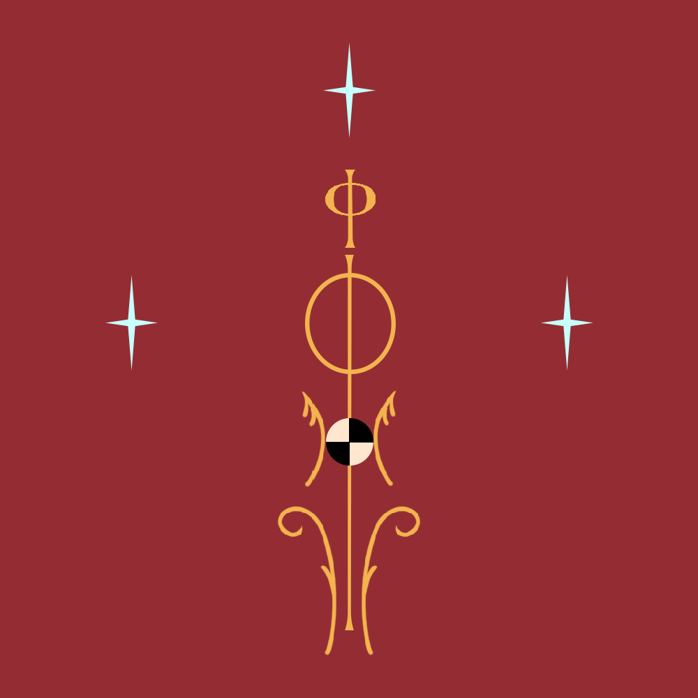

### Overall

  
  Flag of the Empire

Agustonia is a great empire located at the Rinnia Peninsula, near the central regions of [[Anosia]]. It is reigned by four crowns (or four emperors), who rule each region based on the four directions of the globe (currently, the emperors are the only ones who reign, not anymore serving the Clidrios). It extends its cultural borders to almost every other kingdom in the continent, and many of the city states' governments are inspired by the civillian code once created and used by the Agustonian emperors. The southern borders, where the peninsula is covered by continental land, are neighbors with the Reonwanni Mountain Chain and the Golden Fields (Galladia). Onwards to these lands, it is considered no more as a sovereign territory of the empire. Overseas, the empire is also great in its maritime market, trading with almost every other coastal kingdom. The overall living is considered to be high strandards, but mainly at the metropolises. In smaller towns and villages, economy and life is almost as every other in the continent - where rural strandards make the local living stable. In the cities, there is a strong enforce in education, arcane and political schools, each serving under the rule of the single god Tor.
Agustonian history is divided in three great periods, each one categorized by the Clidrios reigning at the time. The first period being the expansion period, the second being the war period, and the third being the renaissance period.
Currently, there is a struggle with the empire's wealth, for the greater economic growth was at the Second Period, where humans forced slavery upon other species inside the empire's territory. After the death of the Second Clidrios in the Great Southern War, almost everything written in the older version of the country's civil code was restructured, for the strict and tyrannic rules had lost their meanings. People were tired of the war, and when the Second Clidrios died at war, all of the political structure went at crisis, and needed to be restructured.
The Third period of Agustonia remains as the most pacific one, where little growth was observed, bearing unstabilization in many of it's facets. 

---
### Political structure

At the top, we have the Clidrios, who is the prime leader of all the empire, serving the god Tor as a medium of communication between humanity and the Hara. In charge of obeying the godly code, Tor conceals the empire many natural benefits that no other kingdom has. Under the Clidrios, there are four emperors who work together, ruling each of the four main regions together, but every decision needs the approval of the Clidrios to be put into work. The emperors are also chosen by the Clidrios to work together with him.
The Clidrios is also blessed by Tor with many vital benefits that extends his life to the fullest a human being can be pushed to. Clidrios can age to almost a thousand years if natural causes end their lives.
Under the Emperors, lay the Lutennos, who work as regional senators for each burg and city of the empire. There are dozends of Lutennos, and they all meet in the Tower of Decisions at Burg La'Ravnnia yearly to update the empire's affairs with the help of the Emperors and the Clidrios himself.

So, summarizing the power structure
Tor>Clidrios>Emperors>Lutennos

---

### General data

Population: ~15 million (Every species)

Official languages: Imperial and it's dialects (Galladi, Aurini and Astrimmo)

Common languages: Many involving the minorities living under the empire (Orc, elvish, and others).

Capital: Burg La'Ravnnia

Denomyn: Imperial

Religion: 85% Tor Monotheism, 10% No religion, 5% Ancient/Lost gods. 

Government: Autocracy

Establishment: Realm of Rono -> Coastal villages -> Federation of the Rinniani Kingdoms -> Empire of Agustonia 

Area:  933.937 km^2

Currency: Austinis (Gold); Talatia (Silver); Brimius (Copper)

---

### Geography

