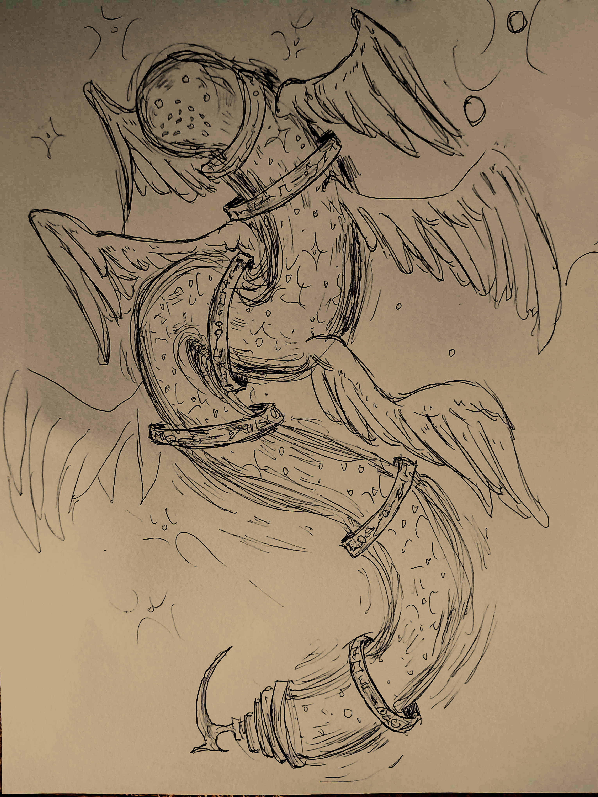

  
  Ulm, the absolute deity of abyss

"He's not a god and not a monster, but a creature, filled with unknown ambitions." - Rono, the king of gods.

Ulm is a *creature* that resides [[The Abyss]] and is often referred as a god, although he does not obey any godly rule. Ulm is the first living being who was born with the ability to create anything, but involuntarily. His body is constantly growing infinitely and releases matter into the abyssal dark matter, and the matter itself can bond once they collide. 

His wings helped him to dive through the dark matter. The golden rings in his body tells the history of the universe with his own runic written language, and every new ring means the beginning of a new era, coming from his lower body to his head, where newer ages are represented as the rings closer to his head.

Time is also a part of Ulm's being, for the entire universe history is registered as a physical space inside his worm-like body. *His body grows as the universe ages*.

---
### Etymology

"Oolm"

Most of the common people in [[Erduim]] are not acknowledged with the presence of Ulm, but serving other gods under him. The existence of the Absolute Creator was recently discovered, and so his name came from the sound which those primitive particles did in the past, those who formed the body of Ulm.

Scholars and Presits from the [[University of Nordech]] had published tomes about Ulm's etymology, and throughout further regions of [[Anosia]] (in other universities or magic schools where the students knew about Ulm), it is uncertain to tell how many different names and nicknames Ulm has. After the research, they had declared an official name to the absolute creator.
